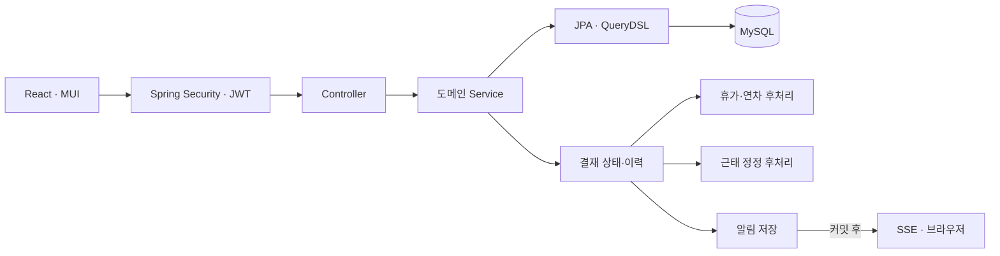
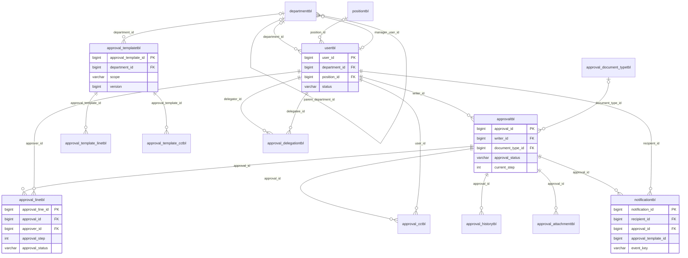
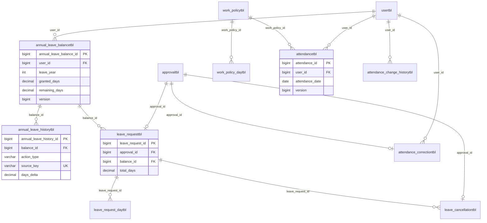

# SideWorks

전자결재를 중심으로 계정·조직, 근태, 휴가, 알림을 연결한 개인 그룹웨어 프로젝트입니다. 기능 수를 늘리는 것보다 **결재 상태 전이, 데이터 정합성, 권한 경계**를 명확히 설계하고 검증하는 데 중점을 두었습니다.

| 영역 | 구현 범위 |
| --- | --- |
| 계정·조직 | JWT 로그인·재발급, 역할별 권한, 사용자·부서·직급 관리, 조직도 |
| 전자결재 | 작성·상신·다단계 승인·반려·취소, 참조자, 첨부파일, 문서 종류 관리 |
| 결재선 | 부서/공용 템플릿, 상신 전 결재자 조정, 기간제 결재 위임, 관리자 강제 종료 |
| 휴가·근태 | 연차 잔액·증감 이력, 휴가/반차 신청·취소, 출퇴근·근태 정정·캘린더 |
| 알림 | 결재 이벤트의 DB 저장, SSE 팝업, 알림함·읽음 처리 |

기술 스택: Java 21, Spring Boot 3.5, Spring Security, Spring Data JPA, QueryDSL, MySQL 8.0, React 19, MUI. 현재 상시 공개된 서비스는 없습니다. AWS EC2·RDS·Nginx에서 V1 흐름을 한 차례 검증한 뒤 비용을 고려해 자원을 정리했습니다.

## 설계 중점

1. **결재선 템플릿과 실제 결재선 분리.** 템플릿은 상신을 돕는 원본이고, 상신 시 조정한 결재자·참조자는 문서별 결재선에 저장합니다. 이후 템플릿 변경이 진행 중인 문서에 소급되지 않습니다. 부서 템플릿은 해당 부서, 공용 템플릿은 전사에 제공하며 인사정보와 달라진 템플릿은 사용을 막습니다.
2. **승인 시 업무 데이터와 이력을 함께 변경.** 휴가 최종 승인에서는 잔액 차감과 사용 이력, 취소 승인에서는 복원 이력을 결재 상태 변경과 같은 트랜잭션에서 처리합니다. 연차 잔액 행 잠금과 `(user_id, leave_year)` 유니크 제약으로 중복·경합을 방어하고, `source_key`로 같은 업무 사건의 이력 중복을 막습니다.
3. **상태를 단일 컬럼으로 뭉개지 않음.** 문서의 전체 상태와 단계별 결재 상태를 구분합니다. 결재 대기함은 `문서 진행 중 AND 현재 단계 대기 중`을 함께 검사합니다. 출퇴근 기록, 지각·조퇴, 휴가 표시도 서로 다른 사실에서 계산합니다.
4. **위임은 도착 시점의 배정 결정.** 기간 중 새로 도착한 단계에만 위임을 적용하며 기존 대기 문서는 건드리지 않습니다. 배정 후 기간이 끝나도 해당 대리인이 계속 처리합니다. 대리인이 작성자·참조자·다른 단계 결재자와 충돌하면 원래 결재자를 유지합니다.
5. **알림의 저장과 실시간 전송 분리.** 알림 레코드는 결재 트랜잭션에 저장하고 SSE는 커밋 후 전송합니다. 연결이 끊겨도 알림함에서 다시 확인할 수 있으며, 조회·읽음 처리와 문서 열람 권한은 서버에서 검증합니다.

이 설계는 개인 프로젝트 규모에서 이해와 유지보수를 우선한 선택입니다. Redis·Kafka, 범용 워크플로 엔진, 자동 인사규정 계산, AI 문서 작성과 조직 통계는 현재 범위에 넣지 않았습니다.

## 프로젝트 구조도

한 개의 Spring Boot 애플리케이션 안에서 도메인별 책임을 나눴습니다. 아래 박스는 별도 마이크로서비스가 아닙니다.

주요 패키지는 `auth`, `user`, `department`, `position`, `approval`, `leave`, `attendance`, `notification`입니다. React는 `frontend/`, 백엔드는 `src/main/java/`, 자동 테스트는 `src/test/java/`에 있습니다.

## DB ERD

아래는 핵심 PK·FK와 업무 관계를 보여 주는 **요약 ERD**입니다. 공통 시각 컬럼, 감사용 참조와 일부 독립 기준 테이블은 가독성을 위해 생략했습니다. 관계선은 테이블 소속을 뜻하며 전체 물리 FK 목록이나 실제 NULL 제약을 대체하지 않습니다. `approval_delegationtbl`은 이후 구현된 기간제 위임 테이블입니다.

### 계정·전자결재·알림

`approval_template_linetbl`·`approval_template_cctbl`은 템플릿의 결재자·참조자이고, `approval_linetbl`·`approval_cctbl`은 문서별 실제 참여자입니다. 알림의 `approval_template_id`는 템플릿 차단 알림에 쓰는 선택적 참조이므로 위 다이어그램에 FK 선으로 표현하지 않았습니다.

### 휴가·연차·근태

`annual_leave_historytbl`의 `GRANT`·`USE`·`RESTORE`는 잔액 변경 원장입니다. 휴가와 근태 정정은 각각 결재 문서에 연결되며, 최종 승인 시점에 업무 데이터를 반영합니다. `employee_number_sequencetbl`, `work_schedule_exceptiontbl`은 다른 테이블과 물리 FK가 없는 독립 기준 데이터입니다.

### 무결성 선택

- `(user_id, leave_year)`, `(approval_id, approval_step)`, `(approval_id, user_id)`처럼 업무상 중복이 허용되지 않는 조합은 DB 유니크 제약으로 막습니다. 서비스 검증은 친절한 오류를 위한 1차 방어이고 제약조건은 동시 요청에 대한 최종 방어입니다.
- `departmenttbl.manager_user_id`와 `usertbl.department_id`는 순환 참조지만 관리자가 없는 부서를 먼저 만들 수 있도록 nullable을 허용합니다. 사용자는 이력 참조 때문에 물리 삭제보다 상태 변경을 사용합니다.
- `approvaltbl.document_type`과 `document_type_id`는 기존 문자열 방식에서 문서 종류 마스터로 전환한 과도기 중복입니다. 무리하게 삭제하지 않고 데이터 이관·호환성을 확인한 뒤 정리할 대상입니다.
- 결재선·연차 잔액 등 수정 경쟁이 가능한 데이터에는 버전 또는 행 잠금을 사용합니다. 이력은 기존 행 수정 대신 새 행을 추가합니다.

## 트러블슈팅과 검증

| 증상 | 원인 확인과 해결 | 확인 방법 |
| --- | --- | --- |
| Access Token 만료 시 여러 API 동시 실패 | 프론트에서 재발급 Promise를 공유해 중복 재발급 경쟁을 줄임 | 짧은 만료 시간으로 Network 요청·재시도 확인 |
| 상신 취소 문서가 대기함에 남음 | 결재선 `PENDING`만 검사하던 쿼리에 문서 `IN_PROGRESS` 조건 추가 | 취소 전후 결재자 대기함 비교 |
| 템플릿 참조자 클릭이 반응 없어 보임 | 선택 상태는 바뀌었지만 CSS 선택 표시가 빠짐 | 선택 색상·인원 수와 실제 저장 확인 |
| 관리자가 막힌 타인 결재에 접근 불가 | 개인 결재함과 별도로 권한 제한된 관리자 결재 관리 화면·API 추가 | 관리자 조회·필터·강제 종료 수동 확인 |
| `contextLoads`에서 Hibernate Dialect 오류 | 실제 원인은 테스트 DB 인증 정보 불일치. 연결 실패가 Dialect 초기화 오류로 이어짐 | 인증 설정 수정 후 별도 기동 테스트 성공 |

프론트 lint·빌드와 DB 기동 테스트를 확인했습니다. 2026-10-01 기록 기준 업무 자동 테스트는 DB 기동 테스트를 제외한 257개가 통과했고, DB 기동 테스트는 올바른 로컬 인증 설정으로 별도 실행해 성공했습니다. **전체 258개를 한 번에 통과시킨 기록은 아닙니다.** 휴가 잔액 차감·취소 복원, 반차 합산, SSE 알림, 템플릿·위임의 주요 흐름은 사용자 브라우저/DB 테스트로 확인했지만 모든 동시성·장애·인사변경 경계를 검증한 것은 아닙니다.

## 향후 확장 방향

현재 구현된 기능을 기반으로 서비스 운영 환경과 데이터 안정성을 강화할 수 있습니다.
- 배포 환경 구축: 비밀값 관리와 HTTPS 적용, SSE 연결을 지원하는 프록시 구성
- 데이터 복구 체계 마련: DB 및 첨부파일 백업·복원 절차 구축
- 서비스 안정성 강화: 프로세스 재시작 정책과 장애 복구 체계 구성

