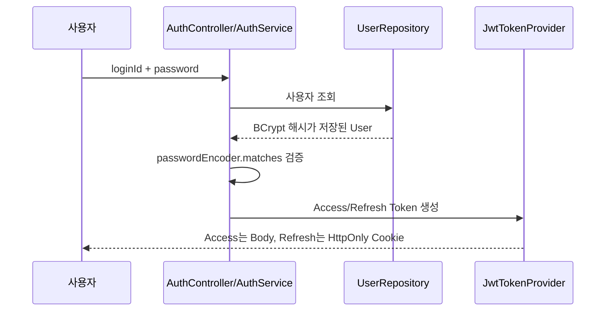
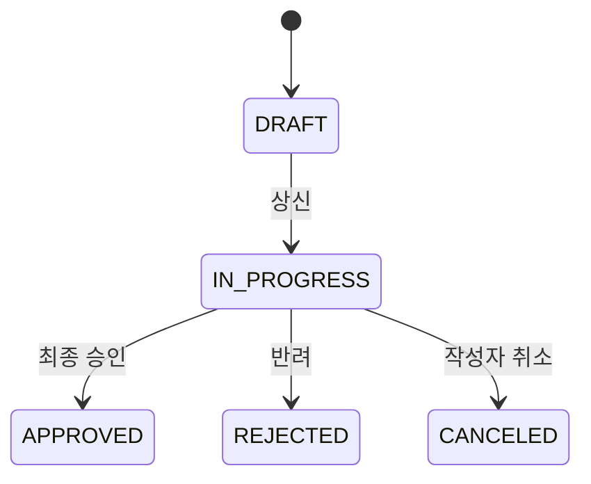
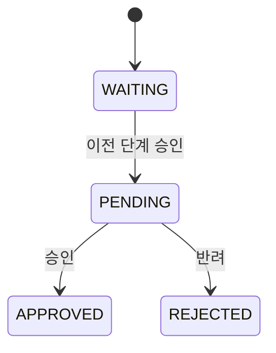

# JWT 인증과 전자결재 흐름

마지막 갱신: 2026-09-07

## 1. 로그인과 인증



Access Token을 사용하는 후속 요청:

```text
Authorization: Bearer {accessToken}
→ JwtAuthenticationFilter가 "Bearer " 제거
→ 서명과 만료 검증
→ userId, loginId, role 추출
→ Authentication을 SecurityContext에 저장
→ Controller의 Authentication에서 loginId 사용
```

비밀번호는 복호화하지 않는다. BCrypt가 입력 비밀번호를 저장된 해시와 `matches`로 비교한다. 서버는 세션을 저장하지 않는 `STATELESS` 구조다.

Access Token이 만료된 경우:

```text
보호 API가 토큰 만료 응답 반환
→ Axios 응답 인터셉터가 POST /api/auth/refresh 호출
→ HttpOnly Refresh Token Cookie 검증
→ 새 Access Token 발급
→ sessionStorage의 Access Token 교체
→ 실패했던 원래 요청 재시도
```

동시에 여러 API가 만료 응답을 받아도 공유 Promise를 사용해 재발급 요청은 한 번만 수행한다. 재발급에 실패하면 Access Token을 제거하고 로그인 화면으로 이동한다. 로그아웃은 Refresh Token Cookie를 만료시키고 프론트엔드의 Access Token을 제거한다.

## 2. 전자결재 상태 전이

문서:



결재선:



결재선에 `CANCELED`를 두지 않은 이유는 취소가 결재자의 처리 결과가 아니라 작성자가 문서 전체를 종료한 행위이기 때문이다.

## 3. 상신

```text
DRAFT 및 작성자 검증
→ 결재자·참조자 요청 검증
→ 사용자 존재·활성 상태·중복·자기 지정 검증
→ 첫 결재선 PENDING, 이후 WAITING 생성
→ 참조자 생성
→ 문서 IN_PROGRESS 전환
→ SUBMITTED 이력 저장
```

`ApprovalService`는 트랜잭션과 순서를, `ApprovalSubmissionValidator`는 규칙을, `ApprovalSubmissionFactory`는 관련 Entity 생성을 담당한다.

## 4. 승인과 반려

승인:

```text
문서 행 잠금
→ IN_PROGRESS 검증
→ currentStep 결재선 조회
→ 현재 결재자 및 PENDING 검증
→ 현재 결재선 APPROVED
→ 실제 다음 단계가 있으면 PENDING
→ 없으면 문서 APPROVED 및 completedAt
→ APPROVED 이력
```

단계를 `currentStep + 1`로 계산하지 않고 실제 다음 `approval_step`을 조회한다. 단계가 `1 → 3`처럼 비연속적이어도 정확히 이동하기 위해서다.

반려:

```text
동일한 잠금·권한 검증
→ 반려 사유 필수 검증
→ 현재 결재선 REJECTED
→ 문서 REJECTED 및 completedAt
→ REJECTED 이력
```

V1에서는 반려 즉시 문서를 종료하며 뒤의 `WAITING` 결재선은 실제 처리 결과가 아니므로 유지한다.

## 5. 상신 취소

```text
문서 행 잠금
→ IN_PROGRESS 검증
→ 작성자 검증
→ processedAt이 존재하는 결재선 확인
→ 처리된 결재자가 없을 때만 CANCELED
→ completedAt 및 CANCELED 이력 저장
```

## 6. 왜 비관적 잠금을 사용하는가

승인과 취소가 동시에 들어오면 둘 다 기존 `IN_PROGRESS` 상태를 읽고 서로 다른 결과를 저장할 수 있다. `PESSIMISTIC_WRITE`로 부모 문서 행을 먼저 잠그면 동일 문서의 승인·반려·취소가 직렬화된다.

```text
요청 A가 문서 잠금 획득
→ 요청 B는 대기
→ A 처리 및 커밋
→ B가 변경된 상태를 다시 확인
→ 중복 처리 거절
```

문서, 결재선, 이력 변경은 하나의 `@Transactional` 범위에 있으므로 중간 저장이 실패하면 모두 롤백된다. 이는 ACID의 원자성을 코드에 적용한 사례다.

## 7. 인증 보완 결과와 남은 과제

완료한 항목:

- Access Token 재발급 API
- 로그아웃과 Refresh Token Cookie 만료
- Axios 인터셉터 기반 자동 재발급과 원래 요청 재시도
- 동시 만료 요청의 중복 재발급 방지
- 짧은 Access Token 유효시간을 이용한 브라우저 검증

V2에서 검토할 항목:

- HTTPS 도입 시 `Secure` 및 `SameSite` Cookie 정책 강화
- Refresh Token 서버 저장, 회전과 강제 폐기 정책
- 인증 실패 응답의 `401 Unauthorized`와 `403 Forbidden` 구분
- 계정 탈취 대응과 Refresh Token 재사용 탐지

V1은 Refresh Token을 HttpOnly Cookie로 보호하지만 서버에서 토큰 상태를 별도로 저장하지 않는다. 현재 규모에서는 단순성을 우선한 선택이며, 다중 기기 로그아웃이나 즉시 폐기가 필요해지면 저장 및 회전 정책을 추가한다.
