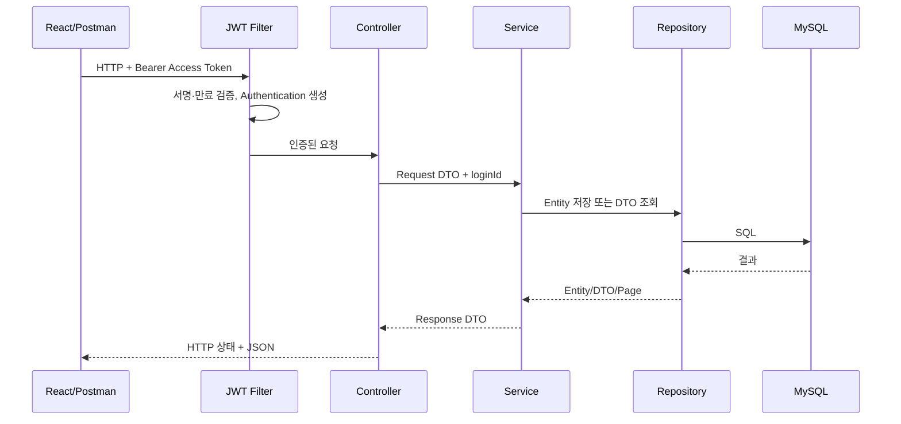

# SideWorks 클래스 구조와 요청 흐름

마지막 갱신: 2026-09-07

## 1. 구조를 한 문장으로 설명하면

SideWorks는 하나의 Spring Boot 애플리케이션을 기능별 패키지로 분리한 **모듈형 모놀리스**이다. MSA처럼 서버를 나누지는 않았지만, 인증·사용자·부서·직급·전자결재의 책임은 패키지로 구분했다.

```text
React / Postman
  → Spring Security Filter Chain
  → Controller
  → Service
  → Validator / Factory / Entity
  → Repository / QueryDSL
  → MySQL
```

DTO와 Enum은 위 흐름의 독립된 계층이 아니다. DTO는 외부 JSON과 내부 객체를 분리하는 데이터 그릇이고, Enum은 상태와 역할처럼 허용된 값의 범위를 제한하는 자료형이다.

## 2. 패키지 구조

```text
com.example.sideworks
├─ auth
│  ├─ controller  AuthController
│  ├─ service     AuthService
│  ├─ jwt         JwtTokenProvider, JwtAuthenticationFilter
│  └─ dto         로그인·토큰 재발급 요청 및 응답 DTO
├─ user
│  ├─ controller  UserController, UserAdminController
│  ├─ service     UserAdminService, EmployeeNumberGenerator
│  ├─ repository  UserRepository, EmployeeNumberSequenceRepository
│  ├─ entity      User, UserRole, UserStatus, JobFamily, EmployeeNumberSequence
│  └─ dto         생성·수정·배정·조회 DTO
├─ department
│  ├─ controller  DepartmentController, DepartmentAdminController
│  ├─ service     DepartmentService, DepartmentAdminService
│  ├─ repository  DepartmentRepository
│  ├─ entity      Department, DepartmentStatus
│  └─ dto         생성·수정·부서장·조회 DTO
├─ position
│  ├─ controller  PositionController, PositionAdminController
│  ├─ service     PositionService, PositionAdminService
│  ├─ repository  PositionRepository
│  ├─ entity      Position
│  └─ dto         생성·수정·조회 DTO
├─ approval
│  ├─ controller  ApprovalController
│  ├─ service     ApprovalService
│  ├─ validator   ApprovalSubmissionValidator
│  ├─ factory     ApprovalSubmissionFactory
│  ├─ repository  ApprovalRepository, ApprovalRepositoryImpl 등
│  ├─ entity      Approval, ApprovalLine, ApprovalCc, ApprovalHistory
│  └─ dto         임시저장·상신·처리·목록·상세 DTO
├─ common
│  ├─ entity      BaseCreatedEntity, BaseTimeEntity
│  ├─ exception   BusinessException, ErrorCode, GlobalExceptionHandler
│  └─ dto         PageResponse
└─ config
   ├─ SecurityConfig
   ├─ JpaConfig
   ├─ QuerydslConfig
   ├─ PageableConfig
   └─ OpenApiConfig
```

## 3. 계층별 책임

| 구성 | 책임 | 하지 않아야 할 일 |
|---|---|---|
| Controller | URL, HTTP Method, 인증 사용자, 요청·응답 | 업무 규칙과 DB 처리 |
| Request DTO | JSON 입력 구조 | Entity 상태 변경과 DB 접근 |
| Service | 트랜잭션과 유스케이스 순서 조정 | HTTP 응답 생성 |
| Validator | 복잡한 업무 규칙 검증 | 저장과 트랜잭션 관리 |
| Factory | 여러 Entity의 생성 규칙 | 조회와 HTTP 처리 |
| Entity | 자신의 상태와 불변식 관리 | Controller나 Repository 호출 |
| Repository | 영속성, 단순·복잡 조회 | HTTP 요청 처리 |
| Response DTO | 외부에 반환할 데이터 모양 | Entity 상태 변경 |

모든 기능에 Validator와 Factory를 만드는 것은 과도한 추상화다. 현재는 참여자 검증과 여러 Entity 생성이 집중된 전자결재 상신에만 사용한다.

## 4. 일반적인 API 처리 과정



## 5. JPA Auditing 상속 구조

```text
BaseCreatedEntity(createdAt)
├─ ApprovalLine
├─ ApprovalCc
├─ ApprovalHistory
└─ BaseTimeEntity(updatedAt 추가)
   ├─ User
   ├─ Department
   ├─ Position
   └─ Approval
```

`@MappedSuperclass`이므로 공통 Entity의 테이블이 따로 생기지 않는다. 생성·수정 가능한 데이터는 `BaseTimeEntity`, 생성 후 기록 성격이 강한 데이터는 `BaseCreatedEntity`를 사용한다.

## 6. 조회 방식 선택

- 단순 CRUD와 고정 조건: Spring Data JPA 메서드 이름 쿼리
- 연관 Entity를 함께 조회해야 하는 단순 화면: `@EntityGraph`
- 결재함·상세처럼 조인, 서브쿼리, 권한 조건이 복잡한 조회: QueryDSL
- 목록에서는 `LONGTEXT` 본문을 제외한 DTO Projection 사용

이렇게 나눈 이유는 모든 쿼리를 한 기술로 통일하기보다 문제의 복잡도에 맞는 도구를 선택하기 위해서다.
