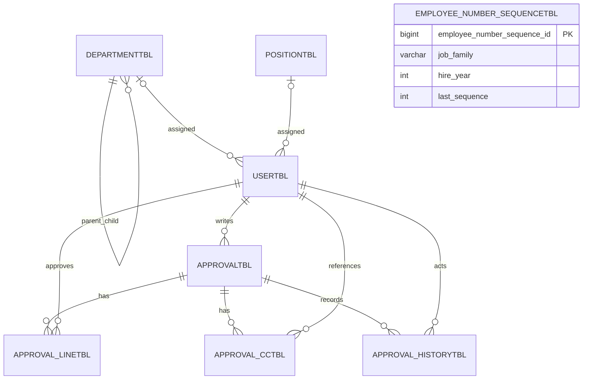

# SideWorks DB 구조와 설계 결정

마지막 갱신: 2026-09-07

## 1. 전체 관계



## 2. 테이블별 역할과 핵심 제약조건

### usertbl

- PK: `user_id`
- Unique: `login_id`, `employee_no`
- FK: `department_id`, `position_id`
- Enum 문자열: `user_role`, `status`
- 직렬 `job_family`: `TECHNICAL`, `CORPORATE`
- 실제 입사일 `hire_date`
- `department_id`, `position_id`는 nullable

초기에는 사용자 생성 시 부서와 직급을 필수로 두었지만, 실제 인사 흐름에서는 계정 생성과 배정 시점이 다를 수 있다. 따라서 다음 흐름으로 변경했다.

```text
계정 생성
→ 부서 또는 직급 미배정 상태
→ 관리자 미배정 사용자 조회
→ 부서·직급을 독립적으로 배정
```

이 구조는 신규 입사자뿐 아니라 직급은 확정됐지만 부서가 아직 정해지지 않은 경력직·전배 대기자도 표현한다.

#### 사번 자동 발급

신규 사용자의 사번은 관리자가 직접 입력하지 않고 직렬과 입사일을 기준으로 서버에서 발급한다.

```text
TECHNICAL + 2026년 + 1번 → TC-26001
CORPORATE + 2026년 + 1번 → CP-26001
TECHNICAL + 2018년 + 1번 → TC-18001
```

직렬별 접두사는 `JobFamily` Enum이 관리한다. 입사 연도는 화면의 현재 연도가 아니라 `hire_date`에서 추출하므로 과거 입사자를 나중에 등록해도 올바른 연도가 사용된다. 발급된 `employee_no`는 Unique 제약으로 보호하고 일반 사용자 수정 API에서는 변경하지 않는다.

### employee_number_sequencetbl

- PK: `employee_number_sequence_id`
- Unique: `(job_family, hire_year)`
- `last_sequence`: 해당 직렬·연도에서 마지막으로 발급한 순번

사번 문자열에서 `MAX + 1`을 계산하면 동시 요청이 같은 번호를 선택할 수 있다. SideWorks는 다음 MySQL 원자 연산을 사용한다.

```sql
INSERT ... VALUES (..., 1)
ON DUPLICATE KEY UPDATE last_sequence = last_sequence + 1
```

동일한 직렬·연도 행은 InnoDB의 행 잠금 아래에서 순차 증가한다. 번호 증가와 사용자 저장은 같은 트랜잭션이므로 사용자 저장에 실패하면 번호 증가도 롤백된다. 현재 형식은 순번 세 자리를 사용하므로 직렬·연도별 최대 999명이며, 초과하면 `EMPLOYEE_NUMBER_EXHAUSTED` 오류를 반환한다.

기존 수동 사번은 그대로 유지한다. `TC-YYNNN`, `CP-YYNNN` 형식인 기존 데이터만 마이그레이션에서 직렬·입사 연도와 마지막 순번을 추론하고, 다른 기존 사번은 `job_family`, `hire_date`가 nullable인 레거시 계정으로 남긴다.

DB 적용 SQL:

```text
database/migrations/20260831_employee_number_sequence.sql
```

현재 Flyway를 사용하지 않으므로 이 SQL은 MySQL에서 한 번만 수동 실행한 뒤 애플리케이션을 재시작한다.

### departmenttbl

- PK: `department_id`
- 자기참조 FK: `parent_department_id`
- 루트 부서의 부모는 `null`
- `status`를 이용한 Soft Delete
- `manager_user_id`로 부서장 식별

동일한 부서명은 허용한다. 서로 다른 상위 조직 아래에 같은 이름의 팀이 있을 수 있고, 실제 식별은 PK로 하기 때문이다.

```text
개발본부 / 플랫폼팀
서비스본부 / 플랫폼팀
```

### positiontbl

- PK: `position_id`
- Unique: `position_name`, `position_order`
- `position_order`: 화면 정렬과 직급 순서

예: `1 사원 → 2 대리 → 3 과장 → 4 차장 → 5 부장`

### approvaltbl

- 문서 작성자, 제목, `LONGTEXT` 본문
- 문서 전체 상태와 현재 결재 단계
- 상신 시각 `submitted_at`
- 최종 승인·반려·취소 시각 `completed_at`

현재 DB COMMENT는 `최종 승인 완료 시각`이지만 실제 코드에서는 승인·반려·취소로 문서가 종료된 시각을 모두 저장한다. 컬럼의 역할은 **결재 종료 시각**이다.

### approval_linetbl

- 상신 시점에 확정된 실제 결재자와 순서
- Unique: `(approval_id, approval_step)`
- Unique: `(approval_id, approver_id)`
- 상태: `WAITING`, `PENDING`, `APPROVED`, `REJECTED`

현재 조직을 매번 계산하지 않고 상신 당시 결재선을 저장한다. 이후 조직이나 직급이 변경되어도 진행 중인 결재의 책임자가 갑자기 바뀌지 않도록 하기 위해서다.

### approval_cctbl

- 문서 참조자
- Unique: `(approval_id, user_id)`

### approval_historytbl

- 행위자 `actor_id`
- 처리 단계 `action_step`
- 행위 `SUBMITTED`, `APPROVED`, `REJECTED`, `CANCELED`
- 의견과 생성 시각

현재 상태만 저장하면 과거 과정을 설명할 수 없다. 이력 테이블은 누가 언제 무엇을 했는지 보존해 감사와 장애 분석에 사용한다.

## 3. 애플리케이션 검증과 DB 제약조건을 함께 쓰는 이유

- 애플리케이션 검증: 사용자가 이해할 수 있는 오류를 빠르게 반환
- DB 제약조건: 동시 요청이나 코드 실수에도 무결성을 지키는 마지막 방어선

예를 들어 중복 결재자는 Validator가 먼저 차단하고, 복합 Unique가 최종적으로 중복 저장을 막는다.

## 4. 삭제 정책

- 조직·사용자처럼 이력이 중요한 데이터: 상태 기반 Soft Delete 우선
- 임시저장 결재 문서: 물리 삭제 가능
- 상신된 문서: 승인·반려·취소 상태와 이력 보존

### 실제 MySQL FK 정책

다음 내용은 2026-07-12에 확인한 `SHOW CREATE TABLE` 결과를 기준으로 한다.

| 자식 테이블·컬럼 | 참조 대상 | ON DELETE | ON UPDATE | 의미 |
|---|---|---|---|---|
| `usertbl.department_id` | `departmenttbl.department_id` | `RESTRICT` | `RESTRICT` | 소속 사용자가 있는 부서 삭제 제한 |
| `usertbl.position_id` | `positiontbl.position_id` | `RESTRICT` | `RESTRICT` | 사용 중인 직급 삭제 제한 |
| `departmenttbl.parent_department_id` | `departmenttbl.department_id` | 기본 `RESTRICT` | 기본 `RESTRICT` | 하위 부서가 있는 부모 부서 삭제 제한 |
| `departmenttbl.manager_user_id` | `usertbl.user_id` | `SET NULL` | `RESTRICT` | 부서장 사용자가 삭제되면 부서장만 해제 |
| `approvaltbl.writer_id` | `usertbl.user_id` | 기본 `RESTRICT` | 기본 `RESTRICT` | 작성 문서가 있는 사용자 삭제 제한 |
| `approval_linetbl.approval_id` | `approvaltbl.approval_id` | `CASCADE` | `RESTRICT` | 문서 삭제 시 결재선 함께 삭제 |
| `approval_linetbl.approver_id` | `usertbl.user_id` | 기본 `RESTRICT` | 기본 `RESTRICT` | 결재자로 기록된 사용자 삭제 제한 |
| `approval_cctbl.approval_id` | `approvaltbl.approval_id` | `CASCADE` | `RESTRICT` | 문서 삭제 시 참조자 함께 삭제 |
| `approval_cctbl.user_id` | `usertbl.user_id` | 기본 `RESTRICT` | 기본 `RESTRICT` | 참조자로 기록된 사용자 삭제 제한 |
| `approval_historytbl.approval_id` | `approvaltbl.approval_id` | 기본 `RESTRICT` | 기본 `RESTRICT` | 이력이 있는 상신 문서 삭제 제한 |
| `approval_historytbl.actor_id` | `usertbl.user_id` | `RESTRICT` | `RESTRICT` | 결재 행위자가 기록된 사용자 삭제 제한 |

MySQL에서 동작을 생략한 FK는 기본적으로 `RESTRICT`와 같은 방식으로 참조 중인 부모 삭제·PK 변경을 차단한다.

### 전자결재 삭제 흐름

```text
approvaltbl
├─ approval_linetbl     ON DELETE CASCADE
├─ approval_cctbl       ON DELETE CASCADE
└─ approval_historytbl  ON DELETE RESTRICT
```

임시저장 문서는 상신 전이라 결재선·참조자·이력이 없으므로 물리 삭제할 수 있다. 상신하면 `SUBMITTED` 이력이 생성되므로 문서 물리 삭제가 제한된다. 이후에는 삭제하지 않고 `APPROVED`, `REJECTED`, `CANCELED` 상태와 이력을 보존한다.

### DB COMMENT 개선 권장

`completed_at`은 최종 승인뿐 아니라 반려와 취소에도 기록되므로 다음 COMMENT가 실제 의미에 더 정확하다.

```sql
ALTER TABLE sidework.approvaltbl
    MODIFY COLUMN completed_at DATETIME NULL
    COMMENT '결재 종료 시각(최종 승인, 반려, 취소)';
```

이 SQL은 문서에 권장 사항으로만 기록했으며 DB에는 실행하지 않았다.

## 5. 인덱스는 언제 추가하는가

Unique와 FK 지원 인덱스 외의 조회 인덱스는 모든 기능을 완성한 뒤 실제 `WHERE`, `JOIN`, `ORDER BY`와 실행 계획을 보고 결정한다. 인덱스는 조회를 빠르게 하지만 저장 비용과 디스크 사용량을 늘리므로 조기 최적화를 피한다.
